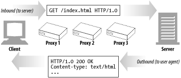
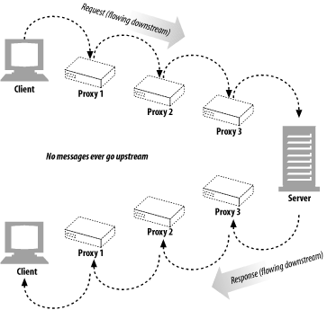
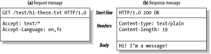
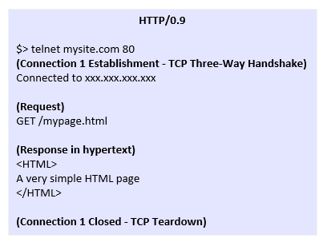
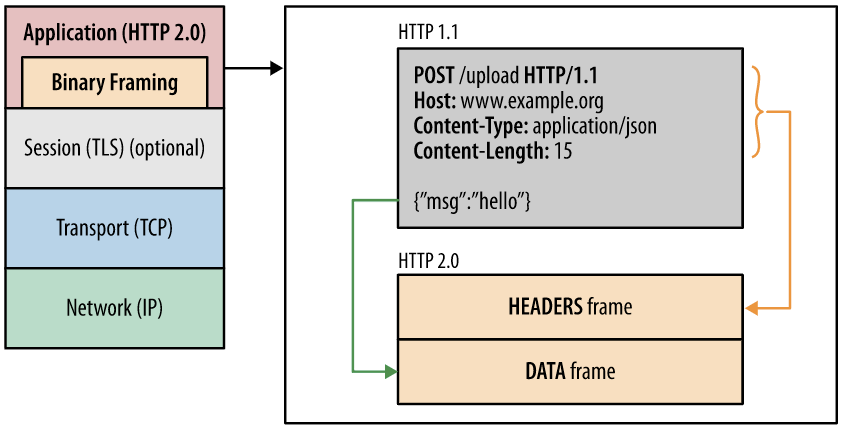
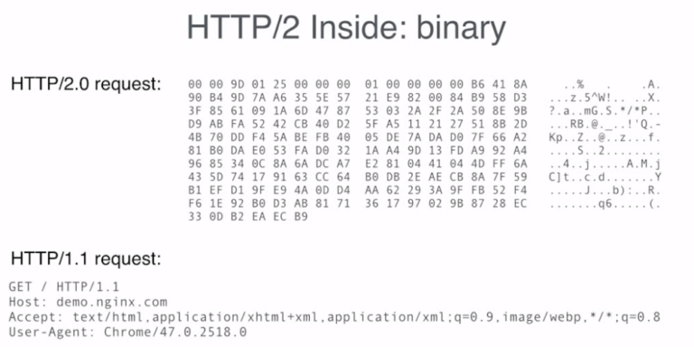
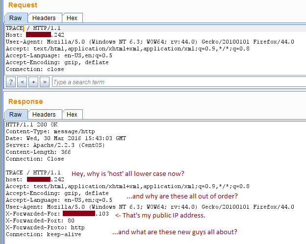
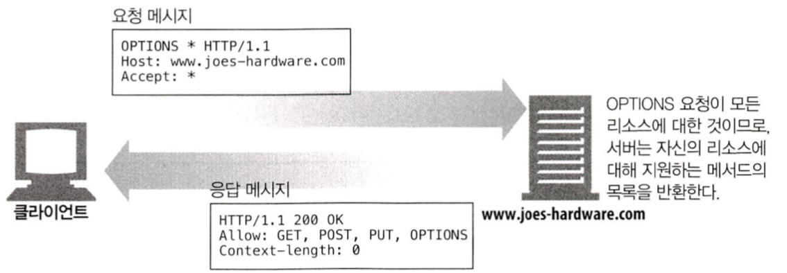
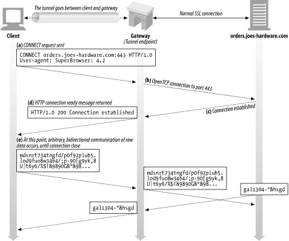

# 3장 HTTP 메시지

## 메시지의 흐름

- 인바운드: 클라이언트에서 서버로 향하는 방향
- 아웃바운드: 서버에서 클라이언트로 향하는 방향

- 다운스트림: 발송자에서 수신자로 흐르는 방향 (발송자가 서버든 클라이언트든)
- 업스트림: 다운스트림의 역방향 (메시지는 절대 업스트림으로 흐르지 않는다)

## 메시지의 각 부분
- 메시지란 그저 데이터의 구조화된 부분이다.
- 메시지는 시작줄(Start line), 헤더, (빈 줄,) 본문(Body)으로 구성되어 있다.
    - 시작줄: 어떤 메시지인지 서술한다.
    - 헤더: 메시지의 속성을 서술한다.
    - (빈 줄: 그냥 비어있는 줄이다)
    - 본문: 데이터를 담고 있다.  

- 시작줄과 헤더는 아스키 문자열이며 각각 CRLF(\r\n)으로 끝난다.
    - CRLF란 EOL(End Of Line)을 정의하는 한 가지 방법
- 본문은 단순히 데이터 덩어리이며 텍스트일 수도 있고 바이너리일 수도 있다.

### 메시지 문법
- 요청과 응답은 기본적으로 구조가 같다. 시작줄에서만 조금 다르다.
    - 요청:
    <메서드> <요창 URL> <버전>
    <헤더>

    <엔터티 본문>
    - 응답:
    <버전> <상태 코드> <사유 구절>
    <헤더>

    <엔터티 본문>
- 메서드: 클라이언트 입장에서 서버가 리소스에 대해 수행해달라고 하는 동작. GET, POST 등
- 요청 URL: 요청 대상 리소스의 경로. 
- 버전: HTTP 버전
- 상태 코드: 요청 결과를 나타내는 세 자리 숫자
- 사유 구절: 상태 코드의 의미를 사람이 읽을 수 있게 설명한 것
- 헤더: 각 헤더 값들은 이름, 콜론, (공백,) 값, CRLF로 구성되어 있다.
- 엔터티 본문: 임의의 데이터 블록을 포함하는 부분. 있어도 그만 없어도 그만이다. 엔터티 본문이 없어도 헤더는 항상 빈 줄로 끝나야 한다.

### 시작줄
- 요청줄: 동작(메서드)과 대상(요청 URL), HTTP 버전을 포함한다.
- 응답줄: HTTP 버전, 수행 결과에 대한 상태 정보(상태 코드, 사유 구절)를 포함한다.
- 메서드: 서버에게 요청하는 행동
    - GET: 서버에서 어떤 문서를 가져온다.
    - HEAD: 서버에서 어떤 문서에 대해 헤더만 가져온다.
    - POST: 서버가 처리해야 할 데이터를 보낸다.
    - PUT: 서버에 요청 메시지의 본문을 저장한다.
    - TRACE: 메시지가 프락시를 거쳐 서버에 도달하는 과정을 추적한다.
    - OPTIONS: 서버가 어떤 메서드를 수행할 수 있는지 확인한다.
    - DELETE: 서버에서 문서를 제거한다.
    - PATCH: 리소스의 일부를 수정한다.
    - POST와 PUT의 차이: 멱등성 (여러 번 수행해도 같은 결과를 보장하는 속성). POST와 달리 PUT은 멱등성을 가진다. (https://developer.mozilla.org/ko/docs/Web/HTTP/Methods/PUT)
- 상태 코드: 서버에서 무엇이 일어났는지 클라이언트에게 말해주는 코드
    - 1XX: 정보
    - 2XX: 성공
    - 3XX: 리다이렉션
    - 4XX: 클라이언트 에러
    - 5XX: 서버 에러

### 헤더
- 메시지에 추가 정보를 더해주는 부분
- 각 헤더는 이름/값 쌍으로 이루어져 있다.
- 헤더 분류
    - 일반 헤더: 요청과 응답 양쪽에 모두 나타날 수 있는 헤더
    - 요청 해더: 요청에 대한 부가 정보를 제공하는 헤더
    - 응답 헤더: 응답에 대한 부가 정보를 제공하는 데허
    - 엔터티 헤더: 본문 크기와 컨텐츠, 혹은 리소스 그 자체를 서술하는 헤더
    - 확장 헤더: 명세에 정의되지 않은 헤더

### 엔터티 본문
- HTTP 메시지가 수송하는 화물이란 뜻에서 payload라고 부르기도 한다.
- 여러 종류의 데이터를 담을 수 있다.

### 버전 0.9 메시지
- 현재의 HTTP보다 훨씬 단순한 프로토콜로 되어 있다.  
  
- 요청은 메서드와 요청 URL만 있고, 응답은 엔터티만 있다.

### 버전 2.0 메시지
- 메시지는 헤더 프레임과 데이터 프레임으로 구성되며, 모든 데이터가 바이너리로 인코딩되어 있다.  
  

## 메서드

### 안전한 메서드
- 서버에 아무 작용도 하지 않는 메서드를 가리킨다.
- GET, HEAD가 이에 해당한다.
- 안전한 메서드의 목적은 HTTP 애플리케이션을 만들 때 사용자에게 안전하지 않은 메서드가 사용될 수 있음을 알려주는 데 있다.

### GET
- 서버에 리소스를 요청하기 위한 메서드

### HEAD
- GET과 같으나 서버가 응답으로 헤더만을 돌려준다.
- 리소스를 가져오지 않고도 리소스의 성질, 존재 여부, 변경 여부 등을 알 수 있다.

### PUT
- 서버에 문서를 쓰기 위한 메서드.
- 요청 URL에 새 문서를 만들거나 문서를 교체하도록 한다 (즉 멱등성이 보장된다).

### POST
- 서버에 입력 데이터(form-data)를 전송하기 위해 사용된다.
- HTML 폼을 지원하는 데 주로 사용된다.

### TRACE
- HTTP 요청은 방화벽, 프락시, 게이트웨이 등의 애플리케이션을 통과하면서 수정될 수 있는데, TRACE 메서드는 최종적으로 서버에 도달한 요청을 확인하기 위해 사용된다.
- 서버는 자신이 받은 요청 메시지를 본문에 넣어 응답을 보낸다.
- 주로 진단을 위해 사용된다.
- 중간 애플리케이션이 메서드에 따라 다르게 작동하는 것을 구별하지 못한다는 문제가 있다.
- 요청에 엔터티 본문을 보낼 수 없다.

### OPTIONS
- 특정 리소스에 대해 어떤 메서드가 지원되는지 알기 위해 사용된다.  

### DELETE
- 요청 URL의 리소스를 삭제할 것을 요청하기 위해 사용된다.
- 삭제한다는 것을 보장하지는 않는다.

### CONNECT
- 프락시 서버에게 서버와 HTTP 터널을 뚫으라고 요청할 때 사용된다.
- 주로 SSL을 사용하는 통신을 하기 위해 사용한다.  

### PATCH
- 요청 URL의 리소스를 부분적으로 변경할 것을 요청하기 위해 사용된다.

### 확장 메서드
- HTTP/1.1 명세에 정의되지 않은 메서드.
- 서버의 리소스에 대한 능력을 확장할 수 있다.