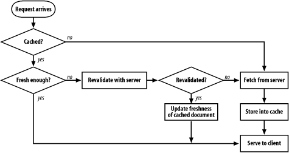
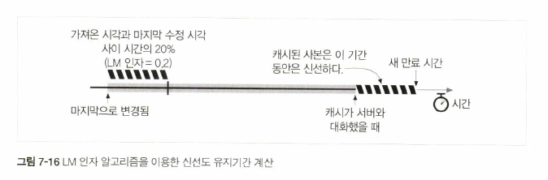
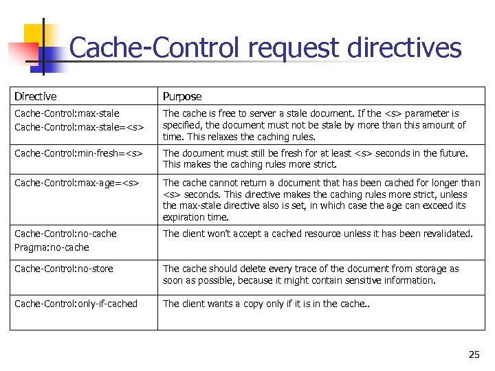

# 7장 캐시


## 캐시 처리 단계


1. 요청 받기: 네트워크 커넥션에서 들어오는 데이터를 읽어들인다.
2. 파싱: 요청 메시지를 파싱한다. 여기에는 절대 URL과 상대 URL의 구분, 대소문자 무시 등이 포함된다.
3. 검색: 요청 URL에 대한 로컬 사본이 있는지 검사한다. 캐시 미스 시 원 서버나 부모 프락시에서 데이터를 가져오거나 실패를 반환한다.
4. 신선도 검사: 캐시된 사본이 신선도 한계를 넘으면 (오래 갖고 있었다면) 서버와 재검사를 한다.
5. 응답 생성: 캐시된 응답은 원 서버에서 온 응답과 구분되지 않아야 한다. 캐시된 객체는 본문뿐만 아니라 응답 헤더까지 포함하고 있으므로 이 헤더를 이용해 응답 헤더를 생성한다. 
    - 캐시가 클라이언트에 맞게 헤더를 조정해주어여 할 때도 있다. 클라이언트가 HTTP/1.1 응답을 요청했는데 서버가 HTTP/1.0 응답을 반환했다면 캐시가 헤더를 번역해줄 책임이 있다.
    - 캐시 신선도 정보 (Cache-Control, Age, Expires 헤더)나 요청이 프락시 캐시를 거쳐갔음을 알려주는 헤더 (Via 헤더)를 포함시킬 때도 있다.
    - 캐시가 Date 헤더를 조정하면 안 된다. Date 헤더는 객체가 원 서버에서 처음 생겨난 때를 나타내야 한다.
6. 전송: 클라이언트에게 응답을 돌려준다. 프락시 서버와 마찬가지로 프락시 캐시는 응답 후에도 클라이언트와 커넥션을 유지해야 한다.
7. 로깅: 캐시 적중/미스 등의 통계를 갱신하고 로그 파일에 요청 종류, URL, 결과 등을 추가한다.


## 사본을 신선하게 유지하기

### Expires와 Cache-Control 헤더
- 캐시된 컨텐츠의 유효기간을 나타내는 헤더들
- Expires 헤더
    - HTTP 1.0 이상에서 사용된다.
    - 절대 유효기간을 명시한다. ex) <code>Expires: Fri, 05 Jul 2002, 05:00:00 GMT</code>
    - 컴퓨터의 시계가 정확할 것을 전제한다.
- Cache-Control 헤더
    - HTTP 1.1에서 처음 도입되었다.
    - 문서의 최대 나이를 정의한다. ex) <code>Cache-Control: max-age=484200</code>

### 서버 재검사
- 만료된 컨텐츠는 원 서버에게 컨텐츠가 변경되었는지 물어보아야 한다.
- 컨텐츠가 변경되었다면 캐시는 문서의 새로운 사본을 가져와 저장한 뒤 클라이언트에게 보내준다.
- 컨텐츠가 변경되지 않았다면 캐시는 새 만료일을 포함한 새 헤더들만 가져와서 캐시 안의 헤더들을 갱신한다.

### 조건부 메서드와의 재검사
- 캐시는 If-Modified-Since와 If-None-Match 헤더를 이용해 원 서버에게 문서가 변경된 경우에만 객체 본문을 보내달라고 요청함으로써 재검사 시 요청을 두 번 보내는 수고를 덜 수 있다.
- If-Modified-Since 헤더
	- 문서가 주어진 날짜 이후로 수정되었을 때만 요청 메서드를  처리한다. ex) <code>If-Modified-Since: Fri, 05 Jul 2002, 05:00:00 GMT</code>
	- If-Modified-Since 재검사 요청은 IMS 요청이라고도 불린다.
	- 만약 문서가 주어진 날짜 이후에 변경되지 않았다면 서버는 304 Not Modified를 반환한다. 응답 헤더는 갱신이 필요한 것만 보내준다.
- If-None-Match 헤더
	- 어떤 문서들은 변경 일시를 기준으로 재검사하는 것이 적절치 않을 수 있다.
		- 일정 간격으로 다시 쓰여지지만 내용은 같은 경우
		- 변경이 사소한 것일 경우 (철자나 주석 등)
		- 서버가 최근 변경 일시를 정확히 알 수 없는 경우
		- 1초보다 작은 간격으로 갱신되는 경우
	- 이런 경우 캐시는 If-None-Match 헤더를 사용해 문서의 엔터티 태그를 기준으로 재검사할 수 있다. ex) <code>If-None-Match: "v2.6"</code>
	- 재갱신 검사를 통과했든 못했든 서버는 문서의 엔터티 태그를 나타내는 ETag 헤더를 함께 반환한다. ex) <code>ETag: "v2.6"</code>

### 약한 검사기
- 조금의 변경은 변경으로 치지 않도록 하는 것으로 HTTP/1.1부터 도입되었다.
- 서버는 컨텐츠의 중요한 내용이 변경될 경우에만 약한 엔터티 태그를 변경한다. 약한 엔터티 태그는 W/ 접두사로 구분한다. ex) <code>ETag: W/"v2.6"</code>

### 언제 무엇을 써야 하는가
- 만약 서버가 엔터티 태그를 반환했으면 엔터티 태그 검사기를 사용하고, 서버가 Last-Modified 값만을 반환했으면 If-Modified-Since를 사용해야 한다 (즉 엔터티 태그 검사기가 우선).
- HTTP/1.1 원 서버는 가능한 한 엔터티 태그 검사기를 보내야 하며, 필요한 경우 약한 엔터티 태그를 보낼 수도 있다. Last-Modified 값을 같이 보내면 더 좋다.
- 만약 캐시나 서버가 If-Modified-Since와 If-None-Match를 모두 받았을 경우, 두 조건 다 부합되는 경우에만 304 Not Modified를 보낸다.

## 캐시 제어

### no-cache와 no-store
- 다음과 같이 사용한다.
	- <code>Cache-control: no-store</code>
	- <code>Cache-control: no-cache</code>
	- <code>Pragma: no-cache</code>
- no-store는 캐싱을 못하도록 한다.
- no-cache는 캐싱을 허용하나 항상 서버와 재검사를 하도록 한다.
- <code>Pragma: no-cache</code>는 HTTP/1.0에서 쓰이던 것으로 하위호환을 위해 HTTP/1.1에도 포함되어 있다.

### Max-Age
- 다음과 같이 사용한다.
	- <code>Cache-Control: max-age=3600</code>
	- <code>Cache-Control: s-maxage=3600</code>
- s-maxage는 공용 캐시에서만 적용된다.

### Expires
- 만료를 절대시각으로 표현한다.
- 많은 서버의 시계가 부정확하기 때문에 Max-age를 사용하는 게 낫다.

### must-revalidate
- 다음과 같이 사용한다.
	- <code>Cache-Control: must-revalidate</code>
- 캐시는 성능 개선을 위해 만료된 객체를 제공하도록 설정될 수 있는데, must-revalidate를 사용하면 그런 설정과 관계없이 만료된 객체는 항상 서버와 재검사하도록 한다.

### 아무런 헤더도 없을 경우
- 캐시가 알아서 유통기한을 구해야 한다.
- LM 인자 알고리즘
	- 문서의 최근 변경일시와 요청 시간 사이의 차이를 이용해 신선도 기간을 구한다.
	- 전제
		- 캐시된 문서가 변경된 것이 오래 전이라면 갑자기 바뀔 가능성이 적은 안정적인 문서일 것이다.
		- 캐시된 문서가 최근에 변경되었다면 자주 변경되는 문서일 것이고 짧은 기간 동안만 캐시해야 한다.
	- 다음과 같이 구한다.
    
	- 보통 상한을 설정하여 신선도 기간이 지나치게 커지는 것을 방지한다.
- Last-Modified 헤더도 없다면 기본 신선도 유지기간을 설정한다. 보통 하루나 한 시간이 된다.

### 클라이언트 신선도 제약
- 클라이언트는 Cache-Control 헤더가 포함된 요청을 통해 신선도 제약을 더 엄격하게 혹은 더 느슨하게 만들 수 있다.


## 캐시 제어 설정: 아파치
### HTTP 헤더 제어하기
- mod_headers 모듈
	- 개별 헤더를 설정할 수 있는 지시어를 사용할 수 있게 한다.
	```
	<Files *.html>
	  Header set Cache-control no-cache
	</Files>
	```
- mod_expires 모듈
	- Expires 헤더를 자동 생성하는 로직을 제공한다.
	```
	ExpiresDefault A3600
	ExpiresDefault M86400
	ExpiresDefault "access plus 1 week"
	ExpiresByType text/html "modification plus 2 days 6 hours 12 minutes"
	```
- mod_cern_meta 모듈
	- HTTP 헤더들의 파일을 특정 객체와 연결시켜준다.

### HTML의 HTTP-EQUIV 태그
- 웹 서버의 설정을 직접 건드리지 않아도 HTML 문서에 헤더 정보를 부여할 수 있도록 하기 위한 HTML 태그로, HTML 2.0에서 도입되었다.
- 문서의 HEAD에 위치하여 문서와 연동되어야 하는 HTTP 헤더들을 정의한다.
```
<HTML>
	<HEAD>
		<TITLE>My Document</TITLE>
		<META HTTP-EQUIV="Cache-control" CONTENT="no-cache">
	</HEAD>
	...
```
- 원래 설계는 HTTP-EQUIV 태그를 웹 서버에서 파싱하여 헤더를 삽입하는 것을 의도하였다.
- 하지만 실제로는 대부분의 웹 서버나 프락시가 이 태그를 지원하지 않는다. 왜냐면 서버 부하를 가중시키고, 설정값이 정적이고, HTML 외의 다른 파일은 지원하지 않기 때문이다.
- 일부 브라우저가 이 태그를 직접 파싱하여 프락시 캐시와 다른 캐시 제어 규칙을 적용해 혼란을 일으킬 수 있다.
- 결론: 쓰지 마라

## 자세한 알고리즘
- 이 절은 중요하지 않기 때문에 건너뜁니다.

## 캐시와 광고
- 캐시의 딜레마: 캐시는 컨텐츠와 광고를 더 빨리 보여줌으로써 광고 노출을 늘릴 수 있다. 하지만 동시에 캐시는 원 서버로의 접근을 흡수하여 실제 노출 횟수보다 집계되는 노출 횟수를 감소시킬 수 있다.
- 오늘날 광고회사들은 여러 캐시 무력화 기법을 사용한다.
	- CGI 게이트웨이를 통해 광고 제공
	- 접근마다 광고 URL 고쳐쓰기
- 특히 웹브라우저의 캐시가 주요 무력화 대상이 되어서 캐싱의 긍정적 효과를 감소시키고 있다.
- 이상적 해결책: 캐싱이 원래대로 이루어지며 캐시가 각 컨텐츠 제공자에게 캐시 적중 횟수를 알려준다.
- 실제 해결책
	- 항상 재검사하도록 캐시를 설정한다.
	- 로그 마이그레이션: 캐시 적중 로그를 남기고 그걸 서버에게 넘겨준다.
		- 로그가 크면 옮기기 어렵다.
		- 개별 컨텐츠 제공자별로 로그가 분리되도록 표준화되어 있지도 않다.
		- 인증, 프라이버시 이슈가 존재한다.
	- RFC 2227: Simple Hit-Metering and Usage-Limiting for HTTP
		- Meter 헤더
			- 캐시 -> 서버: 캐시 적중 횟수를 표시한다.
			- 서버 -> 캐시: 캐시가 서버에게 보고하기 전까지 문서를 제공할 수 있는 횟수나 소모할 수 있는 처리시간을 제어한다 (사용량 제한).