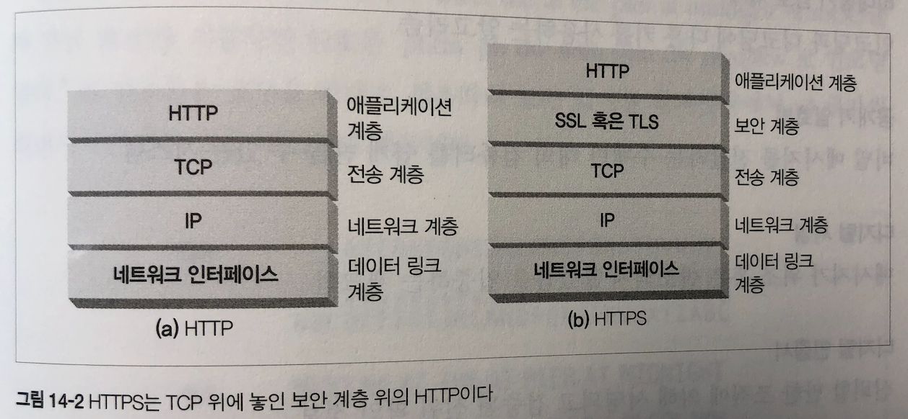
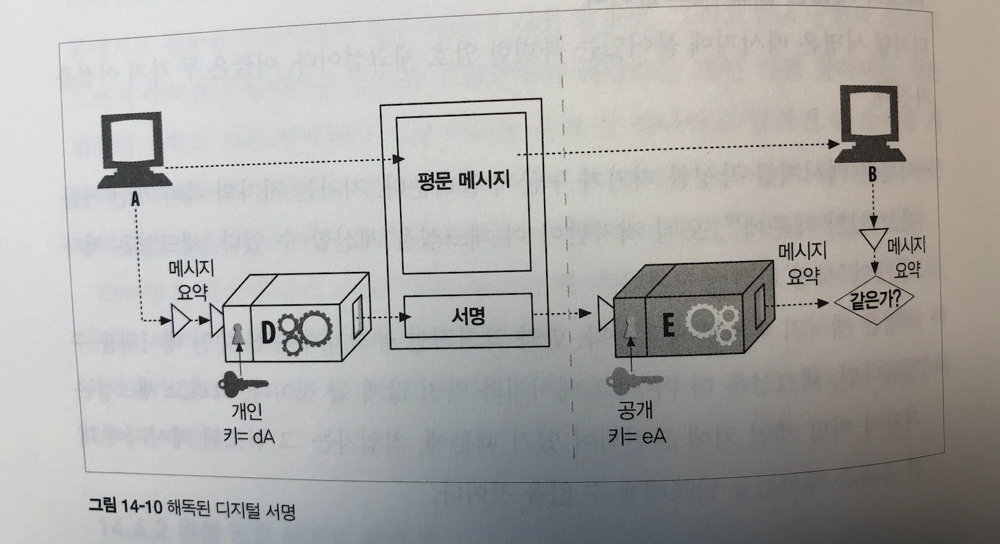
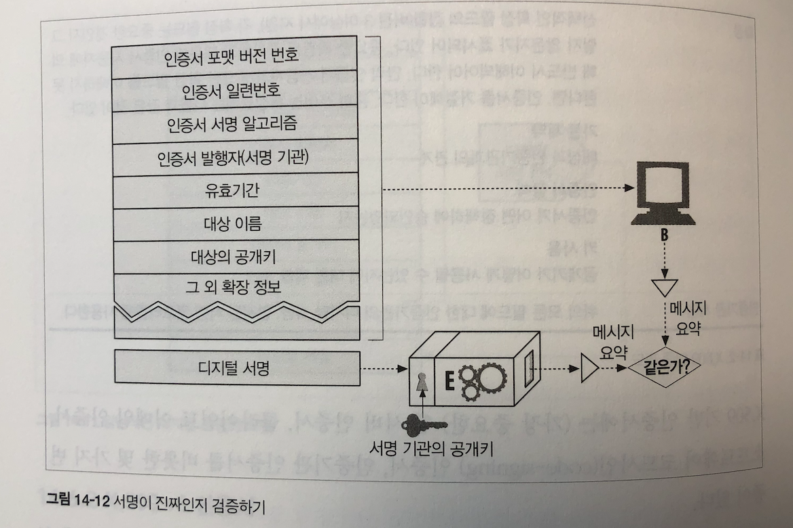

## 14장 보안 HTTP

서버 인증 - 클라이언트는 자신이 위조된 서버가 아닌 진짜와 이야기하고 있음을 알 수 있어야 한다.

클라이언트 인증 - 서버는 자신이 가짜가 아닌 진짜 사용자와 이야기하고 있음을 알 수 있어야 한다.

무결성 - 클라이언트와 서버는 그들의 데이터가 위조되는 것으로부터 안전해야 한다.

암호화 - 클라이언트와 서버는 도청에 대한 걱정 없이 서로 대화할 수 있어야 한다.

효율 - 저렴한 클라이언트나 서버도 이용할 수 있도록 알고리즘은 충분히 빨라야 한다.

편재성(Ubiquity) - 프로토콜은 거의 모든 클라이언트와 서버에서 지원되어야 한다.

관리상 확장성 - 누구든 어디서든 즉각적인 보안 통신을 할 수 있어야 한다.

적응성 - 현재 알려진 최선의 보안 방법을 지원해야 한다.

사회적 생존성 - 사회의 문화적, 정치적 요구를 만족시켜야 한다.

#### 14.1.1 HTTPS

SSL(Secure Sockets Layer) 혹은 TLS(Transport Layer Security)를 이용하여 구현된다.

인/디코딩이 일어나는 층

HTTP -> HTTPS 사용하려면 TCP 입/출력 호출을 SSL 호출로 대체, 보안 정보 설정 및 관리 위한 몇 가지 호출을 추가

### 14.2 디지털 암호학

암호, 키, 대칭키 암호 체계, 비대칭키 암호 체계, 공개키 암호법, 디지털 서명, 디지털 인증서

### 14.3 대칭키 암호법

k 로 암호화 하고 k 로 복호화하는 암/복호화 방법. Ex) DES, Triple-DES, RC2, RC4 등

#### 14.3.1 키 길이와 열거 공격(Enumeration Attack)

비밀 키가 누설되면 안 된다는 것은 매우 중요하다. 대부분의 경우, 인코딩 및 디코딩 알고리즘은 공개적으로 알려져 있으므로, 키만이 유일한 비밀이다.

좋은 알고리즘은 공격자가 코드를 크래킹하려면 존재하는 모든 경우의 수를 다 대입해보는 방법 외에 다른 방법이 없게 만든다. 무차별로 모든 키를 다 대입해보는 방법을 열거 공격이라고 한다.

8비트 -> 256, 40비트 -> 2^40 (약 1조), 128비트 -> 2^128 (약 34x10^37) 요즘은 192비트, 금융기관 등에서는 256비트를 사용한다.

### 14.4 공개키 암호법

공개키 -> 인코딩용, 비밀키 -> 디코딩용 => 비대칭 방식

공개키를 사용하려면 전 세계 모든 컴퓨터 사용자가 같은 암호화 방식을 사용해야하므로 표준화가 필요하고, 이 작업의 중요성 때문에 표준화 작업만 25년 넘게 진행 중(업데이트 중)

#### 14.4.1 RSA

매우 큰 정수의 소인수분해는 어렵다(계산이 오래 걸린다)는 점을 이용한 방식

https://ko.wikipedia.org/wiki/RSA_암호

#### 14.4.2 혼성 암호 체계와 세션 키

비대칭 공개키 암호 방식의 알고리즘은 계산이 느린 경향이 있다. 그래서 실제로는 공개키를 통해 안전한 의사소통 채널을 수립하고, 그 이후에는 대칭키를 생성&교환해서 나머지 데이터를 암호화해서 사용하는 방식

### 14.5 디지털 서명

#### 14.5.1 서명은 암호 체크섬이다

요약본을 개인키로 암호화 / 공개키로 복호화 원본이랑 대조

### 14.6 디지털 인증서

#### 14.6.1 인증서의 내부

-대상의 이름
-유효기간
-인증서 발급자

등 -> 담아서 디지털 서명함수 -> 디지털 서명

#### 14.6.2 X.509 v3인증서

불행히도, 디지털 인증서에 대한 전 세계적인 단일 표준은 없다. -> 대부분의 인증서가 표준으로 사용하고 있는 것으로 보임

https://ko.wikipedia.org/wiki/X.509

https://tools.ietf.org/html/rfc5280.html

#### 14.6.3 서버 인증을 위해 인증서 사용하기

HTTPS를 통한 안전한 웹 트랜잭션을 시작할 때, 최신 브라우저는 자동으로 접속한 서버에서 디지털 인증서를 가져온다.

ref) 한국의 공인인증서
https://namu.wiki/w/SEED#s-4

