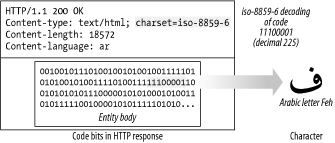
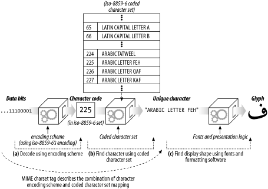
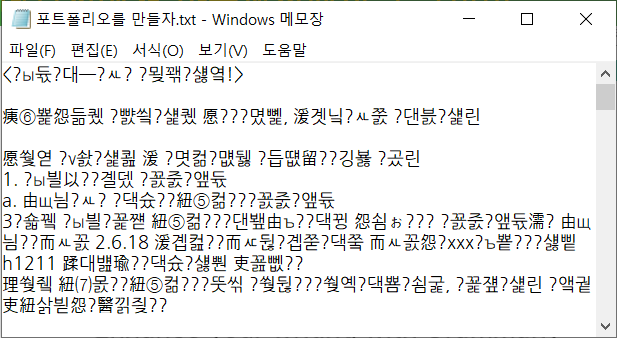
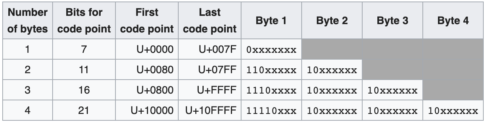

# 16장 국제화
## 국제화를 위한 HTTP 지원
- 컨텐츠는 본질적으로 비트 덩어리이다. 서버는 클라이언트에게 이 비트를 어떻게 읽을 수 있는 문자로 바꾸는지 (+ 어떤 언어인지) 알려주면 된다.
- Content-Type 헤더의 charset 파라미터와 Content-Language 헤더를 이용한다.
```
Content-Type: text/html; charset=utf-8
Content-Language: ko-KR
```
- 클라이언트는 서버에게 어떤 인코딩을 사용할 수 있고 어떤 언어를 이해할 수 있는지 말해줄 수 있다.
- Accept-Charset과 Accept-Language 헤더를 이용한다.
```
Accept-Charset: iso-8859-1, utf-8
Accept-Language: fr, en; q=0.8
```
- 여기서 `q=0.8`은 품질 인자를 말한다. 언어별 선호도를 수치로 나타낸 것이다.

## 문자집합과 HTTP
- HTTP charset 값은 MIME charset에 표준화되어 있고 IANA가 관리하고 있다: https://www.iana.org/assignments/character-sets/character-sets.xhtml#character-sets-1
- 아래 그림의 Content-Type 헤더는 컨텐츠가 HTML 파일이며 iso-8859-6 아랍 문자집합 디코딩 기법을 사용해 디코딩할 수 있음을 알려준다.

- 이 인코딩 상에서 8비트 값 하나는 아랍 문자 하나와 일대일 매핑된다.
- 디코딩 과정에서 비트는 문자 인코딩 구조 (character encoding scheme)를 통해 식별될 수 있는 문자 코드로 변환되고, 여기에 대응하는 문자를 문자집합에서 찾아 그래픽 디스플레이 소프트웨어를 거쳐 사용자에게 표시된다.

- 클라이언트가 잘못된 charset 파라미터를 사용하면 글자가 깨져 보이게 된다.

- 만약 헤더에 charset이 명시되지 않았다면 클라이언트는 우선 HTML 컨텐츠의 META 태그에서 charset을 찾으려고 하고, 그것도 없으면 실제 텍스트를 스캐닝해 인코딩을 추측한다.

## 다중언어 문자 인코딩에 대한 지침
###  용어
- 문자: 알파벳 글자, 숫자, 구두점, 표의문자, 기호 등을 포함하는 글쓰기의 최소 단위.
- 글리프 (glyph): 하나의 글자를 표현하는 다양한 시각적 형태 중 하나
- 코딩된 문자 (coded character): 각 글자에 할당된 유일한 숫자
- 코드 공간 (coding space): 문자 코드 값으로 사용하려고 계획해 둔 정수의 범위
- 코드 너비 (code width): 각 문자 코드의 비트 개수 (고정)
- 사용 가능 문자집합 (character repertoire): 세상에 존재하는 모든 글자의 일부를 선택한 것
- 코딩된 문자집합 (coded character set): 사용 가능 문자집합의 각 글자에 코드 공간의 코드를 대응시킨 것 (ascii, utf-8 등)
- 문자 인코딩 구조 (character encoding scheme): 숫자로 된 문자 코드들을 연속된 비트로 인코딩하고 역으로 디코딩하는 알고리즘. 데이터 압축이나 전송 제약 회피, 중복된 코딩된 문자잡합의 통합 등을 위해 특별한 문자 인코딩 구조를 사용할 수 있다 (예시: https://en.wikipedia.org/wiki/Standard_Compression_Scheme_for_Unicode). 문자 코드를 그대로 비트로 표현할 수도 있는데 이를 아이텐티티 인코딩이라 한다.

### Charset은 형편없는 이름
- HTTP 헤더에서 쓰이는 charset은 엄밀히 말해 문자집합이 아닌 알고리즘을 의미한다. 여기에는 문자 인코딩 구조와 코딩된 문자집합의 개념이 섞여 있다.
- 특히 MIME charset 태그의 이름들은 대개 코딩된 문자집합이나 인코딩 구조의 이름을 그대로 가져다 써서 혼란을 일으킨다.
	- MIME charset에 정의된 iso-8859-1은 실제로는 iso-8859-1 (코딩된 문자집합)과 아이덴티티 인코딩 (문자 인코딩 구조)을 포함하는 것이다.
	- 다른 예시들: https://help.hcltechsw.com/dom_designer/11.0.1/basic/LSAZ_APPENDIX_E_MIME_CHARSET_NAMES.html 혹은 책의 표 16-1

### 문자
- 쓰기의 기본 구성요소.
- 각 문자는 국제 문자 세트 (Universal Character Set, UCS) 계획에 따라 고유한 이름이 부여되어 있다 (예: LATIN SMALL LETTER A)

### 글리프, 연자, 표현 형태
- 글리프란 각 글자를 그리는 특정 방법을 말한다.

- 필기체나 활자체의 경우 두 이어지는 글자는 연자로 표현될 수 있다.

- 문자와 표현 형태는 혼동되어서는 안 된다.

### 코딩된 문자집합
- 정수를 글자로 대응시킨 것을 말한다.
- 보통 코드 번호로 인덱싱된 배열로 구현된다.
#### US-ASCII
- 가장 유명한 코딩된 문자집합으로, 1968년 ANSI 표준 X3.4 '7-Bit American National Standard Code for Information Interchange' 로 표준화되었다.
- 코드 값 0-127만 사용하여 7비트만이 필요하다.
- HTTP 메시지도 US-ASCII를 사용한다.
#### iso-8859
- 유럽 글자들을 표현하기 위해 US-ASCII에 비트 하나를 더 활용해 만든 코딩된 문자집합이다.
- 이 한 비트를 가지고는 유럽의 모든 글자를 담을 수 없어서 지역별로 커스터마이징된 문자 집합이 있다 (iso-8859-1 ~ iso-8859-15).
- HTML은 iso-8859-1을 사용한다.
#### JIS X 0201
- 아스키에 일본어 가타가나 반각 문자를 더한 것이다.
#### JIS X 0208
- 최초의 멀티바이트 일본어 문자집합이다.
- 가타가나와 히라가나에 더해 6879개의 일본식 한자가 정의되어 있다.
#### JIS X 0212
- JIS X 0208에 6607개의 문자를 추가한 것이다.
#### UCS
- 전 세계의 모든 문자를 하나의 코딩된 문자집합으로 통합하기 위한 세계적 표준이다.
- 유니코드라고도 불린다.

### 문자 인코딩 구조
- 문자 코드를 비트들로 인코딩하고 반대로 디코딩하는 알고리즘을 말한다.
- 고정폭 인코딩: 각 코드를 고정된 길이의 비트로 표현한다. 빠르지만 공간을 낭비할 수 있다.
- 가변폭 인코딩 (비모달): 다른 코드에 다른 길이의 비트를 사용한다. 
- 모달 인코딩: 다른 '모드'로의 전환을 위해 특별한 이스케이프 패턴을 사용한다. 예를 들어 다른 문자집합으로 전환하기 위해 이스케이프 패턴을 사용할 수 있다.
#### 8비트 고정폭 아이덴티티 인코딩
- 각 문자 코드를 그대로 8비트 값으로 인코딩하는 구조이다. 당연히 8비트로 표현할 수 있는 문자집합만 지원한다.
#### UTF-8
- UCS의 인코딩을 지원하는 인코딩 구조이다.
- 비모달 가변폭 인코딩을 사용한다.
- 첫 바이트의 앞에서부터 0이 나오기 전까지의 비트 중 1의 개수가 총 바이트 길이를 나타내며, 첫 바이트의 0 이후의 비트와 두 번째 이후 바이트의 뒤 6자리 비트들로 문자 코드를 나타낸다.
- 예외로 7비트 내의 문자 코드는 한 바이트로 표현하며, 이 경우 첫 비트는 0이다. 이를 통해 아스키와 호환된다.

#### iso-2022-jp
- 일본어의 인코딩을 지원하는 모달 인코딩이다.
- 특정 이스케이프 패턴을 이용해 네 가지 문자집합 중 하나로 전환된다.
- 특정 문자집합으로 전환될 경우 글자당 2바이트를 사용하게 된다.
#### euc-jp
- 일본어의 인코딩을 지원하는 비모달 가변폭 인코딩이다.
- 네 가지 코딩된 문자집합을 지원한다.
- 첫 번째 바이트의 값에 따라 문자집합이 결정되고, 이 바이트 이후로 몇 바이트까지 한 글자로 해석할지 정해진다.
#### euc-kr
- 한국어의 인코딩을 지원하는 비모달 가변폭 인코딩이다.
- 두 가지 코딩된 문자집합을 지원한다.
- euc-jp와 마찬가지로 첫 바이트의 값에 따라 문자집합이 결정된다.